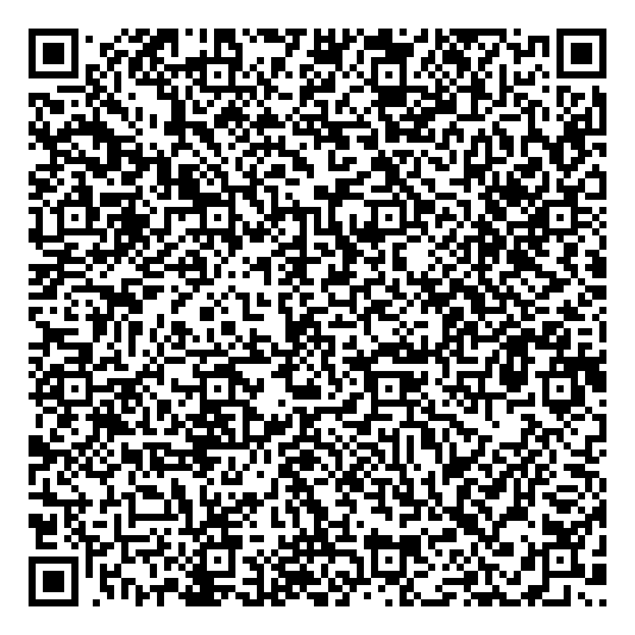
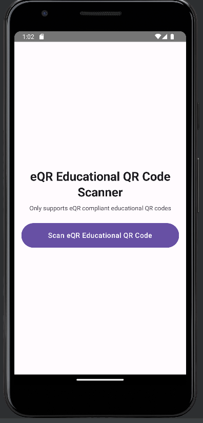
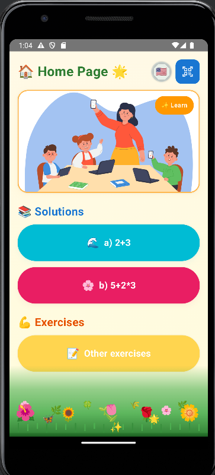
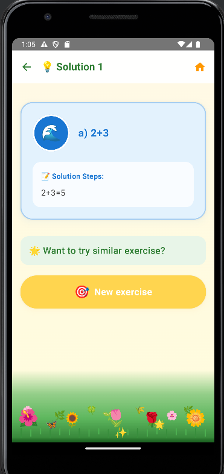
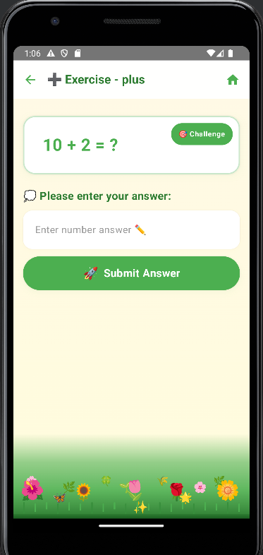
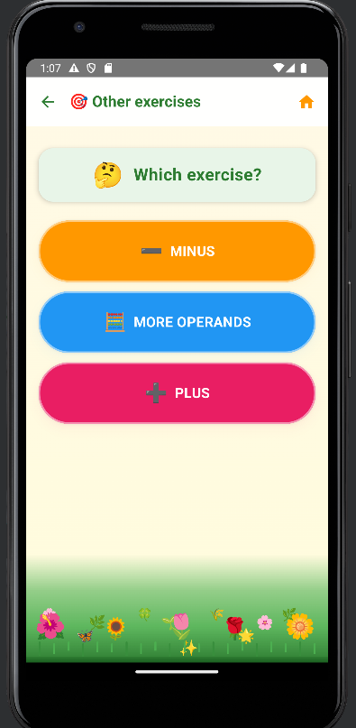
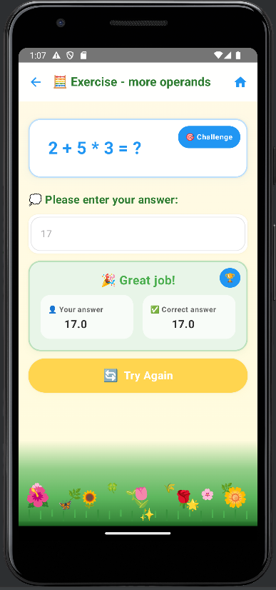
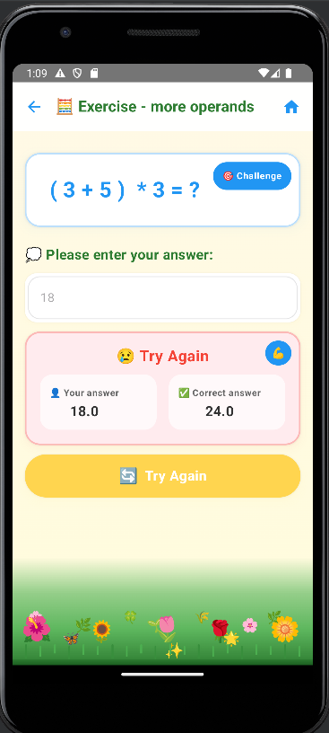
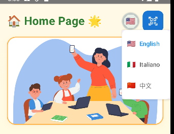

# eQR Educational App - User Guide

## Application Overview

The **eQR Educational App** is a mathematics learning tool designed for **elementary school students**. By scanning special educational eQR codes, students can access detailed solution steps for math exercises and practice related exercises to consolidate their mathematical knowledge.

**How to run the app**
- Scan the educational eQRcode:

---

## Main Screens

### 1. QR Code Scanner Screen
**Function:** Scan educational eQR codes to load math learning content.

**Usage:**
- Click the **scan button**
- Align camera with the QR code
- App automatically loads the content

---

### 2. Home Page
**Function:** Overview of available example questions and entry of practicing exercises.

**Usage:**
- Click **solutions cards** to view detailed solutions
- Click **"Other exercises"** for practice mode
- Use **top buttons** to switch language, or going back to QR Code Scanner Screen

---

### 3.Solution Screen
**Function:** Shows detailed solution steps for understanding how to solve the exercise 
**Usage:**
- Review the **exercise** and **solution steps**
- Click **"New exercise"** for similar practice
- Or navigate back to home

---

### 4. Exercise Selection Screen

**Function:** Choose exercise type - **plus**, **minus**, or **more operations**.
**Usage:**
- Click the operation type button
- Start practicing that type of exercise

---

### 5. Practice Exercise Screen

**Function:** Interactive practice with instant answer verification.
**Usage:**
- Enter your answer
- Click **"Submit Answer"** to check correctness
- Click **"Try Again"** to generate new exercise

**Correct Answer View:**

**Incorrect Answer View:**

---

## Multi-language Support

The app supports **multi-language interfaces**. Switch languages in the **upper right corner** of the home page.
